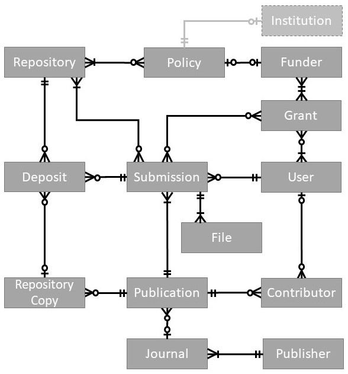

# pass-data-model

PASS provides a unified user interface that allow its users to deposit their manuscripts into multiple repositories as required by the associated funding agency's public access policies. 

In this project you will find
* [Model Objects](#model-objects) - a description of the fields for each object in the model
* [Model Diagram](#model-diagram) - a diagram showing the relationships between each object
* [JSON-LD Contexts](#json-ld-contexts) - contexts used to convert PASS JSON to JSON LD

The Ember application is available in a [separate repository](https://github.com/DataConservancy/pass-ember).

## Model Objects
The data model consists of the following components. Each is documented in full on its own page, you can see all of these pages in the [documentation](documentation/) folder

* [Contributor](documentation/Contributor.md)
* [Deposit](documentation/Deposit.md)
* [File](documentation/File.md)
* [Funder](documentation/Funder.md)
* [Grant](documentation/Grant.md)
* [Journal](documentation/Journal.md)
* [Policy](documentation/Policy.md)
* [Publication](documentation/Publication.md)
* [Publisher](documentation/Publisher.md)
* [Repository](documentation/Repository.md)
* [RepositoryCopy](documentation/RepositoryCopy.md)
* [Submission](documentation/Submission.md)
* [User](documentation/User.md)

The system also automatically creates additional properties for each entity. These are documented in [System Properties](SystemProperties.md).

## Model Diagram
 


## JSON-LD Contexts

JSON-LD contexts used to interpret PASS JSON as RDF can be found in the [src/main/resources](src/main/resources) folder of this project. These can be incorporated into `POST`s or `PUT`s by adding the following property to the JSON e.g.
```
"@context": "https://oa-pass.github.io/pass-data-model/src/main/resources/context.jsonld"
```
